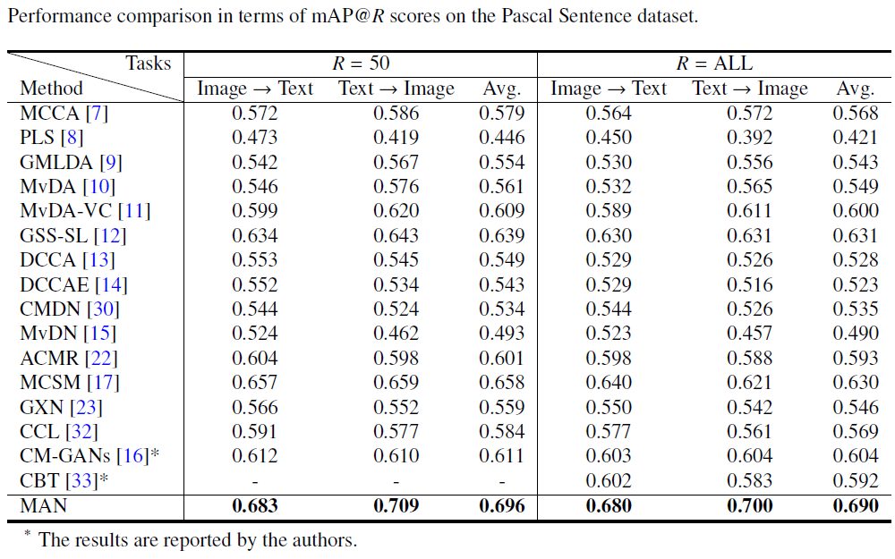

# MAN
[Multimodal Adversarial Network for Cross-modal Retrieval](https://www.sciencedirect.com/science/article/pii/S0950705119302230)

## Abstract
  Cross-modal retrieval aims to retrieve the pertinent samples across different modalities, which is  important in 
 numerous multimodal applications. It is challenging to correlate the multimodal data due to large heterogeneous gap between distinct modalities. In this paper, we propose a Multimodal Adversarial Network~(MAN) to project the multimodal data into a common space wherein the similarities between different modalities can be directly computed by the same distance measurement. The proposed MAN consists of multiple modality-specific generators, a discriminator and a multimodal discriminant analysis~(MDA) loss. With the adversarial learning, the generators are pitted against the discriminator to eliminate the cross-modal discrepancy. Furthermore, a novel MDA loss is proposed to preserve as much discrimination as possible into all available dimensions of the generated common representations. However, there are some problems in directly optimizing the MDA trace criteria. To be specific, the discriminant function will overemphasize 1) the large distances between already separated classes, 2) and the dominant eigenvalues. These problems may cause poor discrimination of the common representations. To solve these problems, we propose a between-class strategy and an eigenvalue strategy to weaken the largest between-class differences and the dominant eigenvalues, respectively. To the best of our knowledge, the proposed MAN could be one of the first  works to specifically design for the multimodal representation learning~(more than two modalities) with the adversarial learning. To verify the effectiveness of the proposed method, extensive experiments are carried out on four widely-used multimodal databases comparing with 16 state-of-the-art approaches.
## Framework


<!--## Result
-->
## Result


## Citing MAN
If you find MAN useful in your research, please consider citing:
```
@article{HU2019,
    title = "Multimodal adversarial network for cross-modal retrieval",
    journal = "Knowledge-Based Systems",
    year = "2019",
    issn = "0950-7051",
    doi = "https://doi.org/10.1016/j.knosys.2019.05.017",
    url = "http://www.sciencedirect.com/science/article/pii/S0950705119302230",
    author = "Peng Hu and Dezhong Peng and Xu Wang and Yong Xiang",
    keywords = "Cross-modal retrieval, Latent common space, Adversarial learning, Multimodal discriminant analysis, Multimodal representation learning",
}
```
